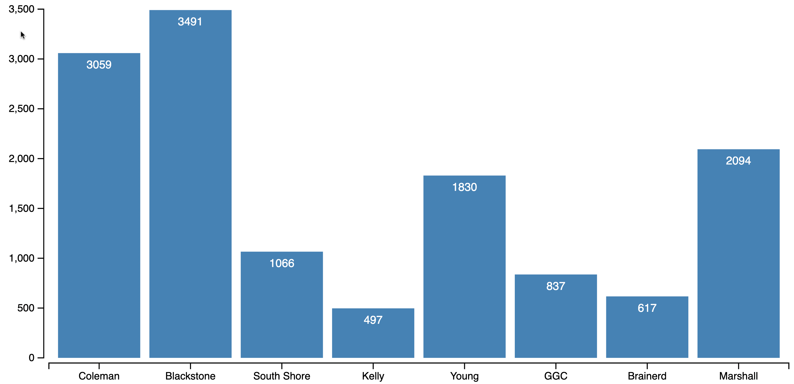

# Week 3
This week, we worked on D3.js to create a bar chart. `index.html` and `script.js` are for in class exercise and `homework.html` and `homework.js` are for week3 assignment. We also worked on data collection for the final project  

## Homework - Bar chart exercise
This is a bar chart for library visits around the Universit of Chicago in January 2022 created by D3.js. Data are taken from [Chicago Data Portal](https://data.cityofchicago.org/Education/Libraries-2022-Visitors-by-Location/ykhx-yxn9). We can observe [Blackstone branch](https://www.chipublib.org/locations/12/) has the highest number of visits, while [Kelly branch](https://www.chipublib.org/locations/40/) has the lowest.  

## Data Colections

This describes collecting data for the final project as a week2 assignment. I will focus on population concentration in Tokyo, one of the biggest concerns in Japan's economy. The overpopulation has caused a sizeable economic gap with other areas, increased the risk of disasters, including the COVID-19 pandemic, and contributed to the declining fertility rate. Although concentrating political, financial, and economic functions on the capital could have raised productivity, it is not sustainable. This is a personal project to address this issue through data vizualization.

## Data source: Title, Agency, Location, Link

- `economics.csv` : Statistical Observations of Prefectures/Labor from [System of Social and Demographic Statistics](https://www.e-stat.go.jp/en/stat-search/files?page=1&layout=datalist&toukei=00200502&tstat=000001162826&cycle=0&year=20220&month=0&tclass1=000001162827&stat_infid=000032169057&tclass2val=0)
- `fertility_rate.csv` : Time Series of total fertility rates by each prefecture from [Vital Statistics](https://www.e-stat.go.jp/en/stat-search/files?page=1&layout=datalist&toukei=00450011&tstat=000001028897&cycle=7&year=20200&month=0&tclass1=000001053058&tclass2=000001053061&tclass3=000001053064&stat_infid=000032118531&result_back=1&tclass4val=0)
- `fertility_rate_all.csv` : Time series of national fertility rate from [Vital Statistics](https://www.mhlw.go.jp/toukei/saikin/hw/jinkou/kakutei21/index.html)
- `foreigners_2020.csv` : Population by Sex and Nationality from [Population Census 2020](https://www.e-stat.go.jp/en/dbview?sid=0003445244)
- `economics.csv` : Statistical Observations of Prefectures/Labor from [System of Social and Demographic Statistics](https://www.e-stat.go.jp/en/stat-search/files?page=1&layout=datalist&toukei=00200502&tstat=000001162826&cycle=0&year=20220&month=0&tclass1=000001162827&stat_infid=000032169057&tclass2val=0)
- `migration.csv` : Number of Net-migration by Age and Sex for Prefectures from [Report on Internal Migration in Japan](https://www.e-stat.go.jp/en/stat-search/files?page=1&layout=datalist&toukei=00200523&tstat=000000070001&cycle=7&year=20210&month=0&tclass1=000001148746&stat_infid=000032163826&result_back=1&tclass2val=0)
- `population.csv` : Time series of total population from [Population Estimates / Time Series](https://www.e-stat.go.jp/en/stat-search/files?page=1&layout=datalist&toukei=00200524&tstat=000000090001&cycle=0&tclass1=000000090004&tclass2=000001051180&stat_infid=000013168601&cycle_facet=tclass1%3Acycle&tclass3val=0)
- `projection_prefecture.csv` : Regional Population Projections for Japan: 2015–2045 from [The National Institute of Population and Social Security Research](https://www.ipss.go.jp/pp-shicyoson/j/shicyoson18/t-page.asp)
- `projection_1997-2017.csv` : Historical National Population Projections for Japan from [The National Institute of Population and Social Security Research](https://www.ipss.go.jp/index-e.asp)
- `projection_f_1997-2017.csv` : Historical National Fertility Rate Assumptions for Japan from [The National Institute of Population and Social Security Research](https://www.ipss.go.jp/index-e.asp)
- `women_migration_2017.csv` : Number of Net-migration by Age and Sex in 2017 from [Report on Internal Migration in Japan in 2017](https://www.e-stat.go.jp/en/dbview?sid=0003211022)

## Description of data

These data are collected from Japan's official national statistics. Each row represents a region (prefecture or municipal), and each column represents an attribute (demographic or economic feature).

## Why you are interested in this topic

I often discussed this topic when I worked for the Japanese government. The low fertility rate and aging population is the biggest issue in Japan, and the overpopulation in Tokyo is one of the driving forces to exacerbate this phenomenon. I believe data visualization can be a powerful tool to provoke discussion on why the population concentration in Tokyo matters.

## Thoughts on how you would hope to use this data

| Data                         | Type of visualization        |
| ---------------------------- | ---------------------------- |
| migration                    | streamgraph or chord diagram |
| population density           | choropleth map or grid map   |
| population projection by age | radial stacked bar chart     |
| fertility rate               | dot plot or line char        |
| economic features (TBD)      | scatter plot or bar chart    |

## Potential data points

I will use either prefecture level data (47 points) or municipal level data (1964 points). The prefecture level data is the primary focused but municiple data might be useful to create granular maps. Interested attirbutes are described above.

## Any concerns about the data

- Some Japanese may require translation to English.
- Need further investigation of each feature and choose the important ones.
- Whether should be prefecture level (47 data points) or municiple level (1300 data points).

## Identify if source is primary or secondary

`migration.csv` is the primary data source. I will use other data sources to observe the consequences of population concentration.

## If secondary data, how you envision this data working with the primary source?

From `demographic.csv`, I will mainly use population density data and plot them into a map. From `economic.csv` and `labor.csv`, I will extract some interesting features that are related to overpopulation. Especially, low fertility rate is one of the known consequences of population concentration, so I will use total fertility rate from `fertility.csv` to compare among time and regions. `prediction.csv` is also an interesting data source to show how the phenomenon has a long lasting influence.
